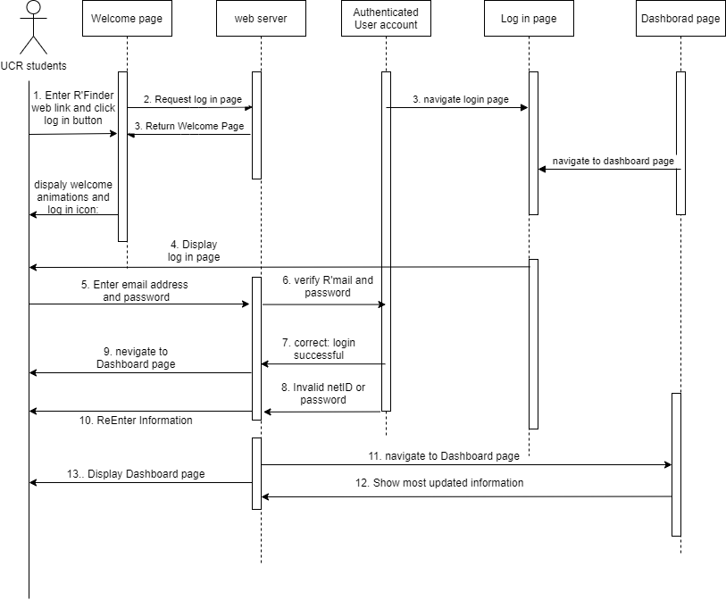
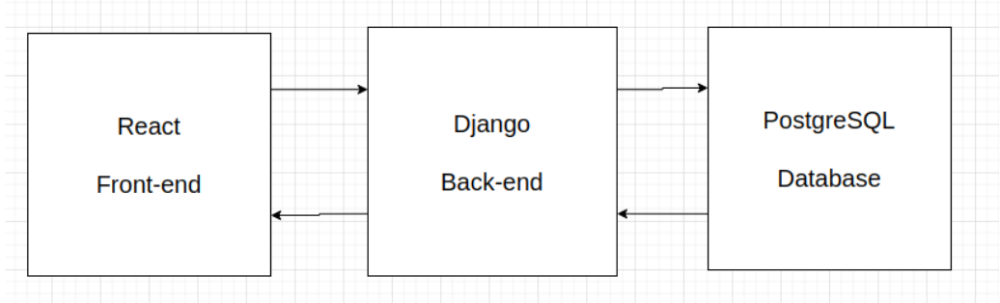
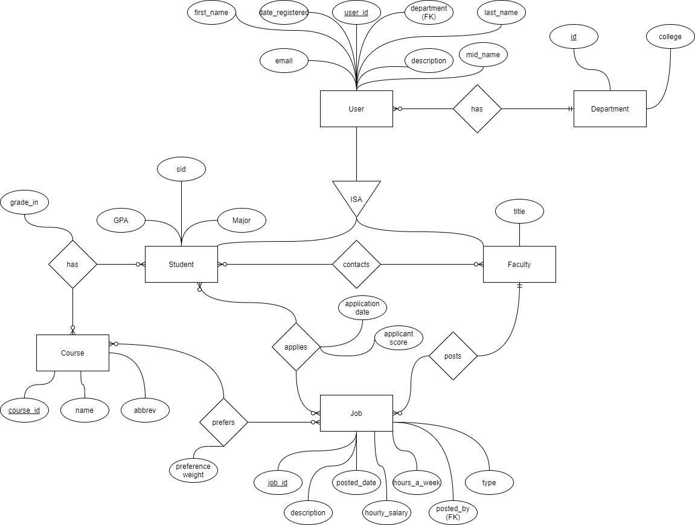

# R'Finder
 Undergraduate TA / Faculty Matching Tool

## Table of Contents
- [Overview](#overview)
- [Usage](#usage)
- [How To Run](#how-to-run)
- [Diagrams](#diagrams)
- [Dependencies](#dependencies)

## Overview
Currently, for some existing web apps for faculty to post jobs and students to apply for jobs, students get overwhelmed by all on-campus and off-campus jobs on the UI page.

In order to be more concentrated on connecting students with faculties members who are seeking undergraduate readers and research assistants. Our app pushes notifications of available applicants to faculties, so they get notified and not missed out. Students’ GPA, courses taken with good grades, preferred course to do reader or research, etc. are listed on students' profiles as well to help faculties to verify and pick. The web also recommends most matched students to faculties as a reference.

It is a good bridge between faculty members and students, which provides opportunities to those excellent and eligible students and faculty members who need to hire students.

## Team
<a href="https://github.com/msalloum" target="_blank">Liam Robbins </a>

<a href="https://github.com/jth06" target="_blank">John Huh </a>

<a href="https://github.com/KatelynCheng" target="_blank">Biqian Cheng</a>

<a href="https://github.com/DiamondKen" target="_blank">Shuang Zhou </a>
## Usage
Demo: <Link to youtube video>

<Screenshot of application>

## How To Run
To run, execute the following command:

### ./rFind

## Diagrams

Sequence Diagram

Frontend Structure

Overall System Diagram

ER-diagram

## Dependencies
Install Node Package Manager (npm). [Helpful Documentation](https://www.npmjs.com/get-npm)
Install the Python Package Installer [(pip3)](https://pip.pypa.io/en/stable/).

